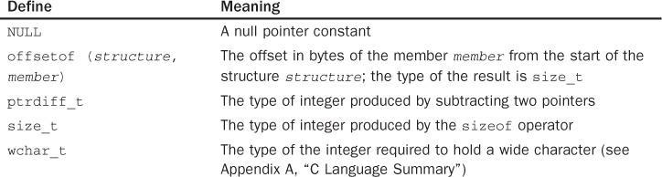
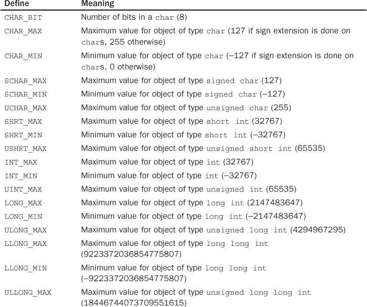
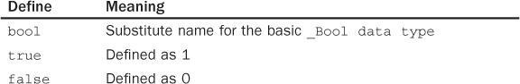

# Section 18: Exploring the Comprehensive Standard C library

## Topic: Deep Dive into Essential Standard C Library Header Files

## Date: 13/10/2025

---

### Cue Column (Questions, Keywords, or Prompts)

- [Insert question or keyword]
- [Insert question or keyword]
- [Insert question or keyword]

---

### Notes Section (Main Notes)

**1. stddef.h**
- `<stddef.h>` - contains some standard definitions

**2. limits.h**

- `<limits.h>` - contains various implementation-defined limits for character and integer data types

**3. stdbool.h**

- `<stdbool.h>` - file contains definitions for working with Boolean variables (type _Bool)

---

### Summary Section (Summary of Notes)

[Insert a brief summary of the key ideas and takeaways]
