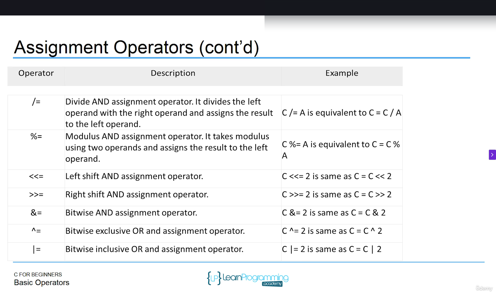

# Section 6: Operators in C: Fundamentals and Categories

## Topic: Arithmetic, Logical, Assignment, and Relational Operators in C

## Date: 08/06/2025

### Notes Section (Main Notes)

**1. Overview**
- An **arithmetic** operator is a mathematical function that takes two operands and performs a calculation on them
- A **logical operator** (sometimes called a **Boolean operator**) is an operator that returns a **Boolean** result that's based on the **Boolean** result of one or two other expressions.
- **Assignment operators** set variables equal to values
    - Assigns the value of the expression at its right to the variable at its left
- A **relational operator** will compare variables against each other.

**2. Arithmetic Operators in C**


**Note**: 

For the ```++``` is the special **operator** which has the specific usage when it is put in the front or behind the variable.
- ```++a```: which means this will increase the value assigned to this variable first then execute the statement.
- ```a++```: which means this will increase the value assigned to this variable after executing the statement.

And this is the same for ```--```

**3. Logical Operators**


**4. Assignment Operators**



**5. Relational Operators**


---

### Summary Section (Summary of Notes)

