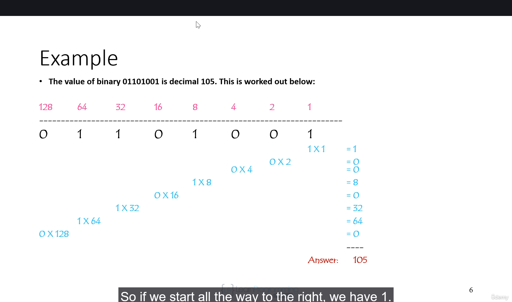
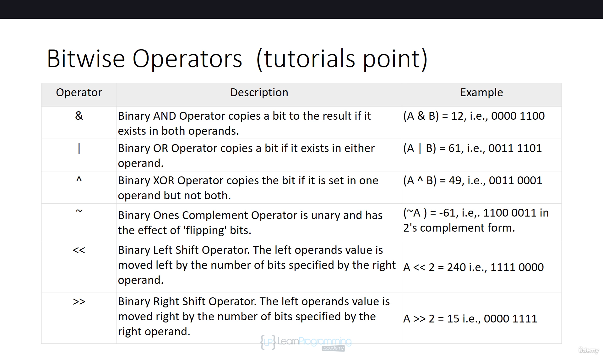
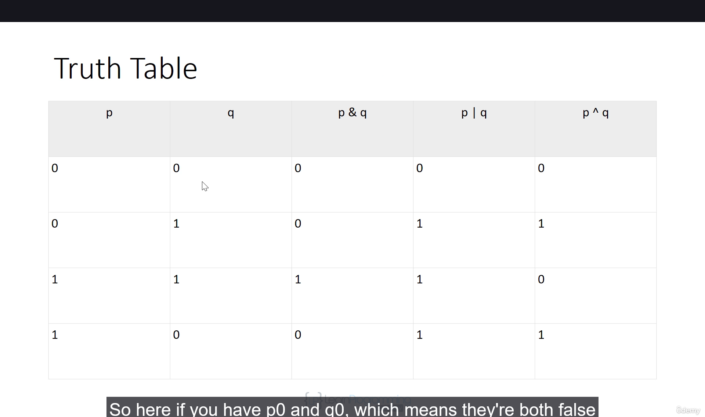

# Section 6: Operators in C: Fundamentals and Categories

## Topic: Bitwise Operators in C: Manipulating Data at the Bit Level

## Date: 09/06/2025

### Notes Section (Main Notes)

**1. Overview**
- C offers bitwise logical operators and shift operators
    - Look something like the logical operators you saw earlier but are quite different
    - Operate on the bits in integer values
- This is not gonna be used in the common program
- One major use of the bitwise ```AND```, ```&```, and the bitwise ```OR```, ```|```, is in the operations to test and set individual bits in an integer variable
    - Can use individual bits to store data that involve one of two choices.
- You could use a single integer variable to store several characteristics of a person.
    - Store whether the person is male or female with one bit.
    - Use three other bits to specify whether the person can speak French, German, of Italian
    - Another bit to record whether the person's salary is $50,000 or more
    - In just four bits you have a substantial set of data recorded.

**2. Binary Numbers**
- A binary number is a number that includes only ones and zeroes
- The number could be of any length
- The following are all examples of binary numbers
    
    ```0```
    ```10101```
    ```1```
    ```0101010```
    ```10```
    ```1011110101```
    ```01```
    ```0110101110```
    ```111000```
    ```000111```
- Every **Binary number** has a corresponding **Decimal value** (and vice versa)
- Examples:

| Binary Number | Decimal Equivalent |
|----------|----------|
| 1    | 1     |
| 10    | 2     |
| 11    | 3     |
...
| 1010111    | 87     |

- Each position for a binary number has a value.
- For each digit, multiply the digit by its position value
- Add up all of the products to get the final result
- In general, the **position values** in a binary number are the powers of two.
    - The first position value is 20, i.e one
    - The second position value is 21, i.e two
    - The second position value is 22, i.e four
    - The second position value is 23, i.e eight
    - The second position value is 24, i.e sixteen

        ...
    

**3. Bitwise Operators**


**4. Truth Table**


---

### Summary Section (Summary of Notes)

