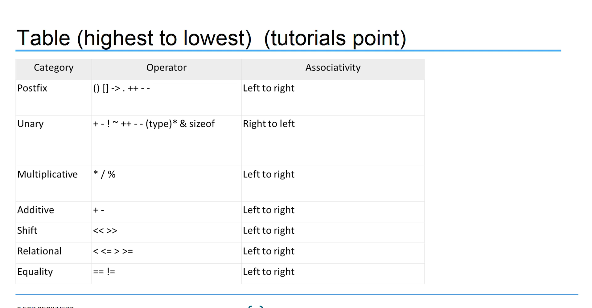
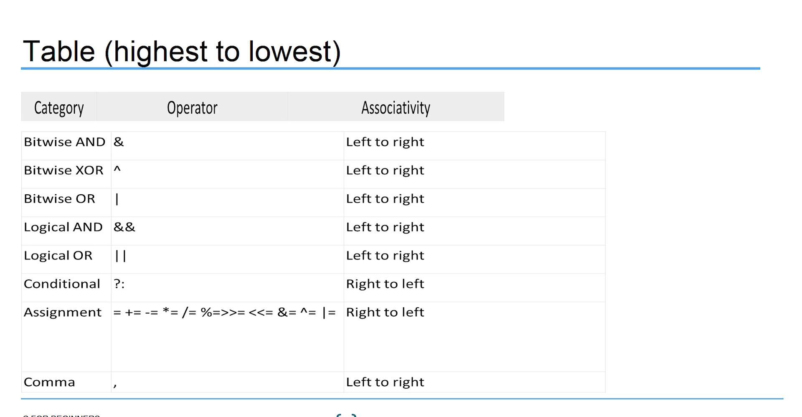

# Section 6: Operators in C: Fundamentals and Categories

## Topic: Order of Operations: Understanding Operator Precedence and Associativity in C

## Date: 23/06/2025

### Notes Section (Main Notes)

**1. Overview**
- **Operator precedence** determines the grouping of terms in an expression and decices how an expression is evaluated.
  - Dictates the order of evaluation when two operators shard an operand
  - Certain operators have higher precedence than others
  - For example, the multiplication operator has a higher precedence than the addition operator

    ```x = 7 + 3 * 2;```
  - This can result in ```13``` or ```20``` depending on the order of each operands evaluation
  - The order of executing the various operations can make a difference, so C needs unambiguous rules for choosing what to do first.
  - In C, ```x``` is assigned ```13```, not ```20``` because operator ```*``` has a higher precedence than ```+```.
    - First gets mutiplied with ```3*2``` and then adds into ```7```
- Each operator is assigned a *precedence* level
  - Multiplication and division have a higher precedence than addition and subtraction, so they are performed first
- Whatever is enclosed in parentheses is executed first, should just always use ```()``` to group expressions.

**2. Associativity**
- What if two operators have the same precedence?
  - The associativity rules are applied

- If they share an operand, they are executed according to the order in which thay occur in the statement
  - For most operators, the order is from left to right.
    
    ```1 == 2 != 3```

- Opertors ```==``` amd ```!=``` have same precedence
  - Associactivity of both ```==``` and ```!=``` is left to right
- The expression above is equivalent to
  
  ```((1 == 2) != 3)```

    - ```(1 == 2)``` executes first resulting into 0 ```false```, then, ```(0 != 3)``` executes resulting into 1 ```true```

**3. Table (highest to lowest)**





---

### Summary Section (Summary of Notes)

